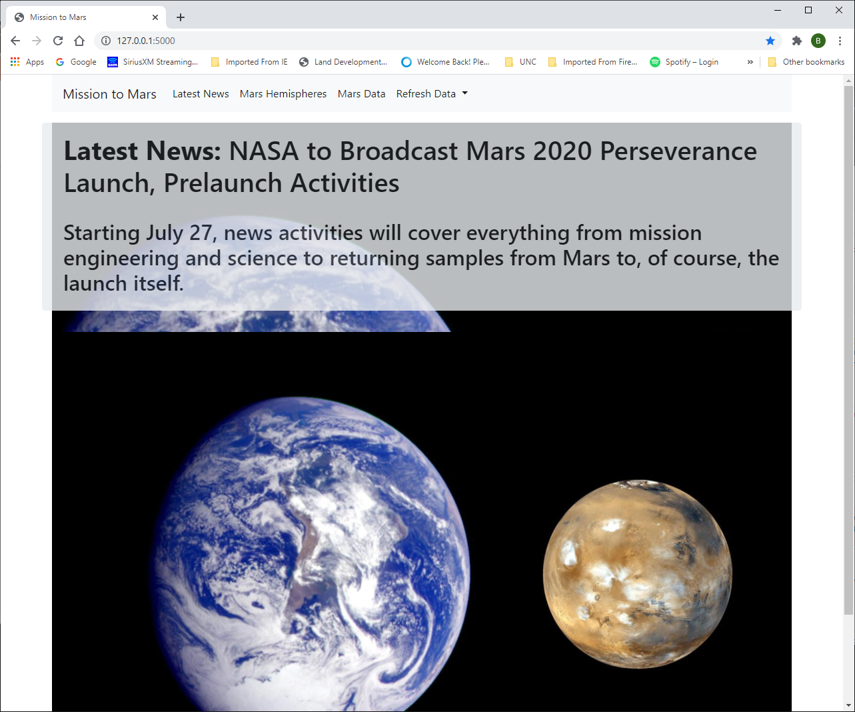
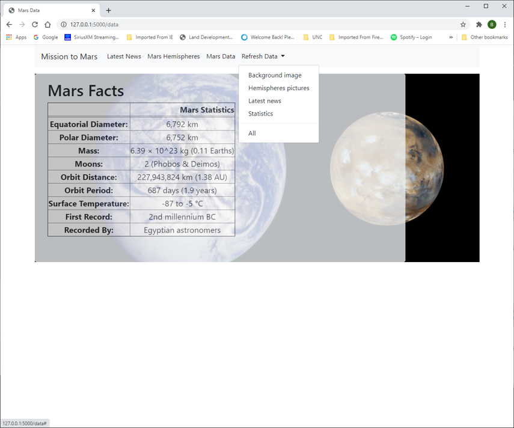
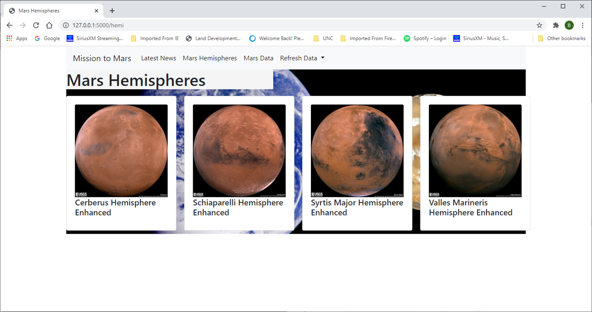

# Mission to Mars

Built a set of web pages that allows the user to pull data from the NASA web sites 
    [NASA Mars News Site](https://mars.nasa.gov/news/) for the latest news, 
    [Facts](https://space-facts.com/mars/) for Mars facts
    [Images](https://www.jpl.nasa.gov/spaceimages/?search=&category=Mars) for feature images
    [Hemispheres](https://astrogeology.usgs.gov/search/results?q=hemisphere+enhanced&k1=target&v1=Mars) for pictures of the hemispheres
    
.  The submition includes 2 main folders.  Mission to mars folder includes the following
  - Mission_to_mars notebook which was used to do the initial analysis
  - Mission_to_mars python file which I converted from the notebook and then created the    
      routines used to scrape the data.
  - app.py python file which is the main file to start the website.  It calls the routines 
      from the mission_to_mars file to scrape the data and then save the data into MongoDB. 
      The application creates a Mars_app Mongo database and multiple collections.
          mars_data for the filename where I store the statistic table html.  I used this
               before understanding about using ' | safe'
          mars_img for the image used for the background
          mars_news for the latest news
          mars_pic for the documents with the hemispheres
  - miscellaneous folders associated with converting the python Mission_to_mars file to ddls
  - Template folder storing the html files
  - Screenshots folder showing the final web pages

[About](Screenshots/Introduction_page.png)

